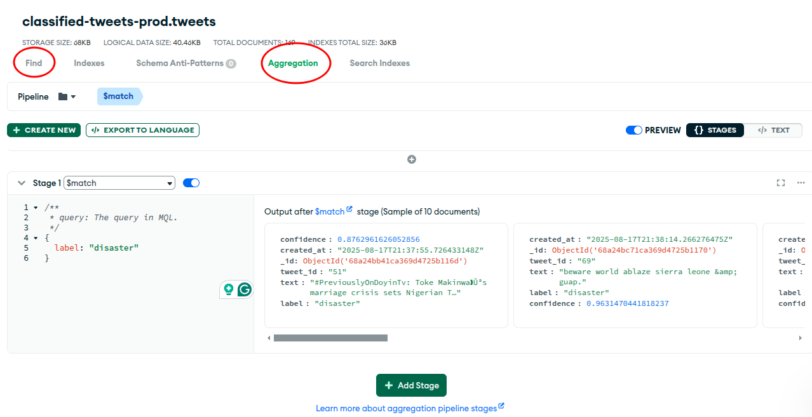

# Visualization Service

The Visualization Service is implemented in Grafana and is responsible for displaying the data stored in the MongoDB database. It provides a user-friendly interface to visualize disaster-related tweets and their classifications.

The Grafana Server can be accessed here: [Grafana Server](https://monkin77.grafana.net/).

## Development
To build MongoDB queries in Grafana, we can use go to MongoDB Cloud and build the queries in the MongoDB Atlas UI. Once the queries are built, we can copy them into Grafana. As shown in the image below, the platform allows building *find* and *aggregate* queries interactively, easing the process of creating complex queries without needing to write them manually.

